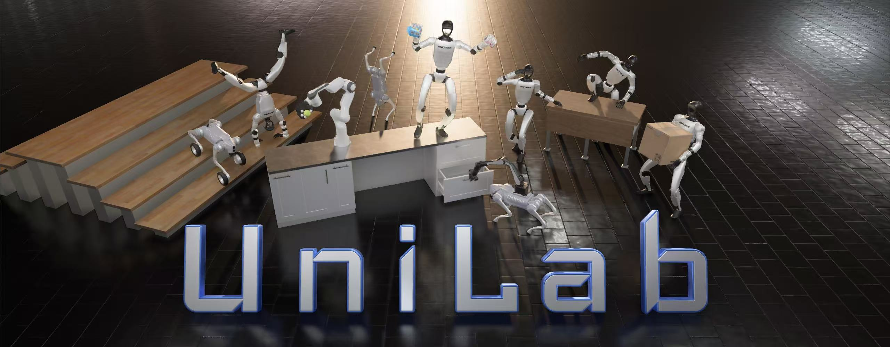

<h1 align="center"> UniLab </h1>

<h3 align="center">
A Heterogeneous Training Architecture for Robot Reinforcement Learning
</h3>

<p align="center">Languages: English | <a href="docs/users/zh_CN/01-getting-started.md">简体中文</a></p>

<p align="center">
  
</a>

Train robot RL without a GPU simulation backend.

UniLab uses **CPU simulation + shared-memory runtime + GPU learning** instead of coupling simulation and learning inside one GPU-resident pipeline.

```
┌───────────────────┐                            ┌─────────────────────────┐
│  CPU Physics Sim  │   Unified Shared Memory    │   GPU Policy Training   │
│   MuJoCo/Motrix   │ ─────────────────────────▶ │     PPO / SAC / TD3     │
│ Multithread Step  │    SharedReplayBuffer      │ CUDA / MPS / ROCm / XPU │
└───────────────────┘                            └─────────────────────────┘
```

Start with the `Quick Demo` below to run the primary training command from this repository.
Conda and pip users should still follow the repository `uv` workflow for now; see [install](docs/users/zh_CN/A-getting-started/01-install.md#conda--pip-用户说明) for the current boundaries.

## 🚀 Quick Demo

```bash
# 0. If uv is not installed
curl -LsSf https://astral.sh/uv/install.sh | sh

# 1. Clone the repository
git clone https://github.com/unilabsim/UniLab.git
cd UniLab

# 2. Install dependencies
# Choose exactly one command for your platform; do not run all three.

# Linux CUDA or macOS
make setup-motrix
# Without shell completion setup: uv sync --extra motrix
# If `make` is not installed: uv sync --extra motrix && uv run --no-sync unilab-complete install

# Linux AMD / ROCm
# make sync-rocm

# Linux Intel Arc / iGPU
# make sync-xpu

# 3. Run a first PPO training job
uv run train --algo ppo --task go2_joystick_flat --sim motrix
```

This is the first-level training entrypoint. It routes to the registered `go2_joystick_flat/motrix` task owner config and keeps backend selection in the CLI flags.

For evaluation and demo playback:

```bash
uv run eval --algo ppo --task go2_joystick_flat --sim motrix --load-run -1

# Headless Motrix video export for Linux/server runs
uv run eval --algo ppo --task go2_joystick_flat --sim motrix --load-run -1 --render-mode record

# Demo playback from a local trained checkpoint
uv run demo
```

On macOS / MacBook, the UniLab CLI routes Motrix interactive playback through `mxpython` when needed. Motrix defaults to interactive playback; use `--render-mode record` for headless video export or `--render-mode none` to skip playback. Detailed script-level commands are documented under `docs/users/zh_CN/`.

<!-- On Linux AMD / ROCm workstations, `make sync-rocm` requires ROCm 7.1 or newer, installs the PyTorch ROCm 7.2 wheel (`torch==2.11.0+rocm7.2`), and activates the ROCm profile as the current `pyproject.toml` / `uv.lock` so regular `uv run ...` commands work after setup. Restore `pyproject.toml` / `uv.lock` from git to switch back to the default CUDA / macOS profile. -->

<!-- On Linux Intel Arc / iGPU workstations, `make sync-xpu` installs the PyTorch XPU wheel (`torch==2.7.0+xpu`) which bundles the Intel oneAPI compiler/SYCL runtimes. The GPU userspace driver itself must come from the system package manager — on Ubuntu 24.04+ / 26.04 install `intel-opencl-icd` and `libze-intel-gpu1` (kernel 6.2+ ships the i915 driver). Use `uv run --no-sync ...` after the swap so `uv` does not resync the default Linux CUDA wheel. Off-policy training (`--algo sac` / `--algo flashsac`) supports bf16 mixed precision via `training.use_amp=true` on XPU; on-policy PPO does not need AMP. -->

### Interactive Notebooks

Prefer a guided, step-by-step experience? Open the notebooks in Jupyter:

- [Demo Notebook](notebook/demo.ipynb): local checkpoint playback via `uv run demo`
- [PPO Training Walkthrough](notebook/unilab_walkthrough_ppo_go1_joystick_mujoco.ipynb): end-to-end guide from config preview to training to playback, with explanations for beginners

> Notebooks require a local environment (no Colab support) — MuJoCo needs local compute.

## 🏃 Example Runs

These are example repository runs for documented commands and hardware setups. They are useful as concrete entrypoints and reported timings, but they are **not** yet a formal benchmark manifest.

```bash
uv run train --algo sac --task g1_walk_flat --sim mujoco
```

```bash
uv run train --algo sac --task g1_sac_wbt --sim mujoco training.use_amp=true
```

```bash
uv run train --algo ppo --task sharpa_inhand --sim mujoco --profile hora
```

More training commands, script-level entrypoints, resume flow, and W&B details are in [03 Training Guide](docs/users/zh_CN/03-training.md).

## 🎯 Training Entrypoints

Use `uv run train` for training, `uv run eval` for checkpoint playback, and `uv run demo` for the local demo preset. These commands are the first-level training interface and keep algorithm, task, and backend selection explicit.

See [03 Training Guide](docs/users/zh_CN/03-training.md) for the algorithm matrix, log directory layout, Hydra overrides, script-level entrypoints, and demo flags.

## 📚 Documentation

Use [docs/README.md](docs/README.md) as the documentation index. High-signal entrypoints:

- [Getting Started](docs/users/zh_CN/01-getting-started.md): installation, Docker runtime, dependency setup, and first-run commands
- [Training Guide](docs/users/zh_CN/03-training.md): training, playback, resume flow, Hydra overrides, and W&B
- [Simulation Backends](docs/users/zh_CN/02-simulation-backends.md): generated MuJoCo / Motrix support matrix
- [Development Standard](docs/developers/zh_CN/development-standard.md): contracts, layering, and validation boundaries
- [ADR Index](docs/developers/adr/ADR-0000-index.md): accepted architecture decisions
